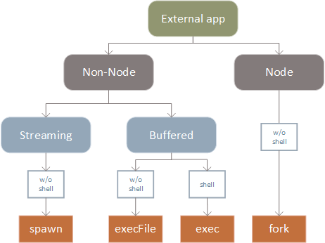

# 08-hello-executable-node-scripts

> creating a shell script programmed in Node.js and invoking it from a Node program using `execFile`

## Description

This example illustrates how to create a shell script using Node.js as the language. In order to do that, it's enough to use the *shebang*:

```bash
#!/usr/bin/env node
```

Once you do that, you can write your own program using Node modules etc. and it will be subject of being invoked as a regular shell script.

As such, you will also be able to invoke it as if it were a regular executable, Non-Node.js program using for example `execFile`.

In Node.js, the `child_process` module allows you to execute other applications (including Node applications).
It provides 4 different async methods that are intended for different scenarios:
+ `execFile` &mdash; execute an external application, given a set of arguments, and callback with the buffered output after the process exits.
+ `spawn` &mdash; execute an external application, given a set of arguments, and provide a streaming interface for I/O and events for when the process exits.
+ `exec` &mdash; execute one or more commands inside a shell an callback with the buffered output after the process exits.
+ `fork` &mdash; execute a Node module as a separate process, given a set of arguments, provide a streaming and eventd interface like `spawn` and also set up an inter-process communication (IPC) channel between the parent and child process.

