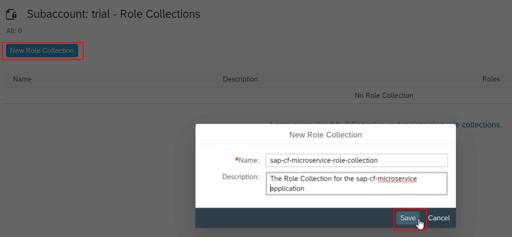
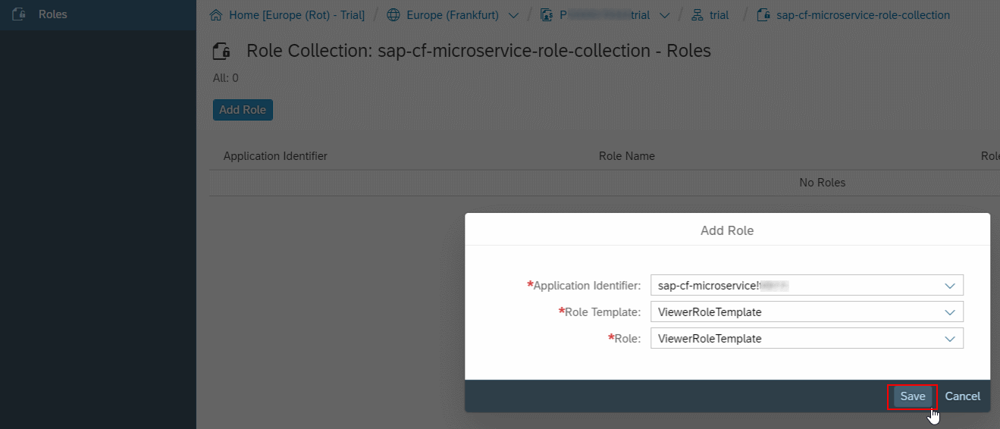
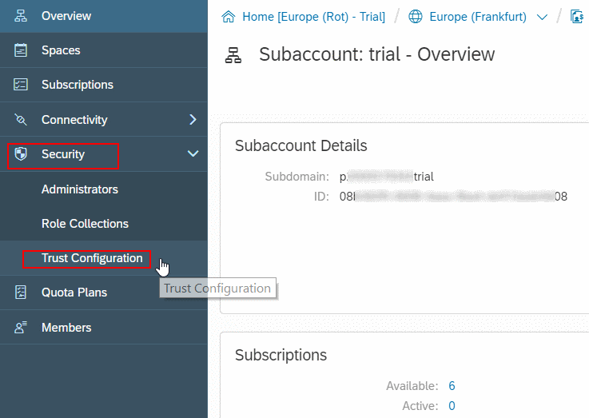
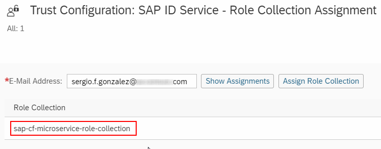

# 02-hello-sap-cf-auth-microservice
> Express-based Node.js microservice subject of being deployed to SAP Cloud Foundry featuring authentication and authorization checks.

## Description

This example illustrates how to deploy the simplest *Express* application to SAP Cloud Foundry.
The following endpoint is defined: `/api/heartbeat`.

## Configuration
Authentication in the SAP CF environment is provided by the UAA service. In this example, *OAuth 2.0* is used as the authentication mechanism.

This section describes the procedure to enable authentication in an Express-based, Node.js application:

1. A file `./xsuaa/xs-security.json` is updated to include information about scopes and roles:
```json
{
  "xsappname": "sap-cf-microservice",
  "tenant-mode": "dedicated",
  "scopes": [
    { "name": "$XSAPPNAME.Display", "description": "Display Users" },
    { "name": "$XSAPPNAME.Update", "description": "Update Users" }
  ],
  "role-templates": [
    { "name": "ViewerRoleTemplate", "description": "View Users", "scope-references": [ "$XSAPPNAME.Display" ] },
    { "name": "ManagerRoleTemplate", "description": "Maintain Users", "scope-references": [ "$XSAPPNAME.Display", "$XSAPPNAME.Update" ] }
  ]
}
```

2. The existing *xsuaa* service instance `sap-cf-microservice-xsuaa` is updated with the command :
```bash
cf update-service sap-cf-microservice-xsuaa -c xsuaa/xs-security.json
```

3. Change the code to include the authorizer. This has been developed as a middleware for simplicity.
The necessary code to authorize at the endpoint level is extremely simple: you just invoke the `authorizer.checkScope` method passing the required *scope* as the argument.
```javascript
app.get('/api/v1.0/users', authenticator.secureEndpoint(), authorizer.checkScope('Display'), api.users.getUsers);
app.post('/api/v1.0/users', authenticator.secureEndpoint(), authorizer.checkScope('Update'), api.users.createUser);
```

The authorizer itself is also very simple. It just uses some additional methods included in the *request*:
```javascript
function checkScope(requiredScope) {
  return (req, res, next) => {
    if (!req.authInfo || !req.authInfo.checkScope) {
      return next(createError.InternalServerError('Request does not feature the necessary authorization support'));
    }
    const scopeToCheck = `$XSAPPNAME.${ requiredScope }`;
    debug(`Checking for authorization to ${ scopeToCheck }`);
    const isAuthorized = req.authInfo.checkScope(scopeToCheck);
    if (isAuthorized) {
      next();
    } else {
      next(createError.Forbidden(`User did not feature the required scope: ${ requiredScope }`));
    }
  };
}
```

4. Now, the application is ready to be deployed with `cf push`.

5. The next set of steps have to do with the configuration of the security artifacts in SAP Cloud Foundry. The first thing you have to do is to navigate to the `sap-cf-microservice` application in the SAP Cloud Platform cockpit. There, you will have to see the *role templates* defined in the `xs-security.json`.
If the screen is empty, validate that the `xs-security.json` syntax is correct and that the `sap-cf-microservice-xsuaa` syntax was correctly updated.


6. After that, navigate to your subaccount and click on *Security* &raquo; *Role Collections*


7. In that screen, define a new *Role Collection* named `sap-cf-microservice-role-collection`.


8. Then, click on the newly defined *role collection* to add the templates. 


You will need to perform this action twice to add both the *Viewer* and *Manager* roles.



9. The last step consist in assigning the `sap-cf-microservice-role-collection` to the business users of the application. In order to do that, you have to navigate to *SAP ID Service* that can be found from the options in your subaccount, under *Security* &raquo; *Trust Configuration*.



10. In that screen, type the email address of the business users and assign the corresponding role collection.




As the business user has been assigned with a role collection that includes both the *Viewer* and *Manager* roles the user will be authorized to use both the `GET` and `POST` operations on the endpoint.

11. Now, you will have to obtain a *bearer token* to access the application, by sending an HTTP request to the authentication endpoint to obtain a fresh JWT token that include the corresponding *scopes*.

**NOTE**
If you send a valid JWT token issued before the business user were assigned the corresponding roles, you will still get the *403 - Forbidden* status.
```bash
curl -v -X POST \
--header "Content-Type: application/x-www-form-urlencoded" \
-G \
--data-urlencode "grant_type=password" \
--data-urlencode "client_id=<the-client-id>" \
--data-urlencode "client_secret=<the-client-secret>" \
--data-urlencode "username=<your-SAP-CF-username>" \
--data-urlencode "password=<your-SAP-CF-password>" \
<the-authentication-endpoint>/oauth/token
```

12. With the new token, now you can successfully invoke the `GET /users`:
```bash
$ curl --verbose \
--header "Content-Type: application/json" \
--header "Accept: application/json" \
--header "Authorization: Bearer <the-access-token-from-the-previous-step>" \
https://sap-cf-microservice.cfapps.eu10.hana.ondemand.com/api/v1.0/users
...
[{"id":0,"username":"jason.isaacs"},{"id":1,"username":"idris.elba"}]
```

13. You can also create a new user using the `POST /users` request:
```bash
curl --verbose \
--header "Content-Type: application/json" \
--header "Accept: application/json" \
--header "Authorization: Bearer <the-access-token-from-the-previous-step>" \
--data '{"username": "jeremy.irons"}' \
https://sap-cf-microservice.cfapps.eu10.hana.ondemand.com/api/v1.0/users
...
> Content-Length: 28
>
< HTTP/1.1 201 Created
< Location: /users/2
...
{"username":"jeremy.irons","id":2}
```

Note that we're returning an *HTTP status code* 201 (Created) and set the `Location` header to the id of the user created.  

14. Now you can test again, 
```bash
$ curl --verbose \
--header "Content-Type: application/json" \
--header "Accept: application/json" \
--header "Authorization: Bearer <the-access-token-from-the-previous-step>" \
https://sap-cf-microservice.cfapps.eu10.hana.ondemand.com/api/v1.0/users
...
[{"id":0,"username":"jason.isaacs"},{"id":1,"username":"idris.elba"},{"id":2,"username":"jeremy.irons"}]
```

15. Now, you can try again modifying the role collection, so that only the *Viewer* role is assgined. 

Note that you need to obtain a new JWT token after performing the change in the cockpit. 
Now, the `GET /users` should work, but not the `POST`, which will fail with a *403 - Forbidden*.
```bash
curl --verbose \
--header "Content-Type: application/json" \
--header "Accept: application/json" \
--header "Authorization: Bearer <the-access-token-from-the-previous-step>" \
--data '{"username": "tom.hiddlestone"}' \
https://sap-cf-microservice.cfapps.eu10.hana.ondemand.com/api/v1.0/users
...
< HTTP/1.1 403 Forbidden
...
{"statusCode":403,"errorName":"ForbiddenError","error":"User did not feature the required scope: Update"}
```

```bash
$ curl --verbose \
--header "Content-Type: application/json" \
--header "Accept: application/json" \
--header "Authorization: Bearer <the-access-token-from-the-previous-step>" \
https://sap-cf-microservice.cfapps.eu10.hana.ondemand.com/api/v1.0/users
...
< HTTP/1.1 200 OK
...
[{"id":0,"username":"jason.isaacs"},{"id":1,"username":"idris.elba"},{"id":2,"username":"jeremy.irons"}]
