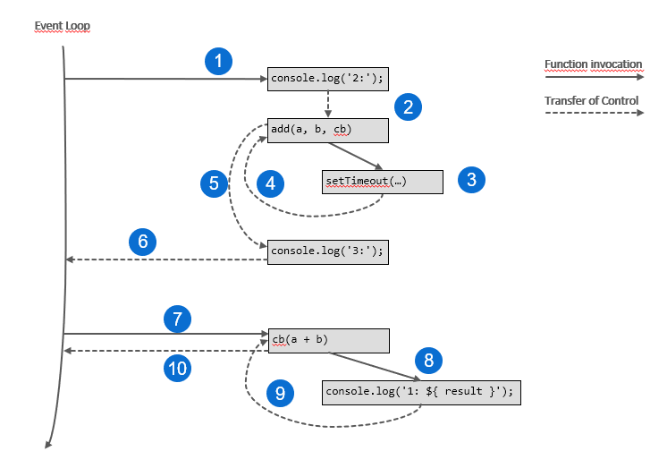

# Part 4: Node.js avanced patterns and techniques
## Chapter 29 &mdash; Callbacks and Events in depth 
> TBD

### Contents (TBD)
+ The **Callback** pattern &mdash; conventions and pitfalls
+ The **Observer** pattern in Node.js

### Intro
In synchronous progreamming, code can be seen as the execution of a series of consecutive computing steps that solve a specific problem. Every operation is blocking, meaning that only when an operation is completed, it is possible to advance to the next one.

By contrast, in asynchronous programming, certain operations are performed *in the background*. These operations are non-blocking, meaning that When we invoke an asynchronous operation, the instruction that follows is executed immediately after, even if the previous one hasn't finished yet. 
In this scenario, we need to get notified when that background operation completes, and the most basic mechanism is the **callback** &mdash; a function that will be invoked by the runtime with the result of the asynchronous operation when it has completed.

| NOTE: |
| :---- |
| The **callback** is the mechanism on which all other async mechanisms are based: promises, async/await, events,... That is why it is so important to master it. |

Once familiarized with the **callback** pattern, we will learn about the **Observer** pattern and how to implement it with the `EventEmitter` class.

### The **Callback** pattern
*Callbacks* are the materialization of the [**Reactor** pattern](../chapter27-nodejs-platform-fundamentals#the-reactor-pattern).
> *Callbacks* are functions that are passed as arguments to other functions and invoked to propagate the result of an operation. In the asynchronous world, they replace the use of the `return` instruction.

JavaScript is the ideal programming language for *callbacks*, because functions in JavaScript are first-class citizens &mdash; they can be assigned to variables, passed as arguments to functions, returned from another function &mdash; and the language supports the concept of *closures*, so that functions created in that way can reference the environment in which they were created no matter when the callback is invoked.

#### The continuation-passing style
In functional programming, the way of propagating the result of an operation by invoking a callback that is passed as an argument to another function is known as **continuation-passing style (CPS)**.

This concept is not only associated to async operations &mdash; the style only states that the result of an operation is propagated by passing it to another function instead of directly returning the result to the caller.

##### Synchronous CPS
The following code illustrates a function that sums the arguments received using a *direct style*.

```javascript
/* direct style */
function add(a, b) {
  return a + b;
}
```

By contrast, the following one uses the *continuation-passing style*:

```javascript
function add(a, b, cb) {
  cb(a + b);
}
```

Note that there are no async operations involved, and thefore:

```javascript
console.log(`2: continuation-passing style: `, add_cps(2, 3, (result) => console.log(`1: result=`, result)));
console.log(`3: finish`);
```
will print:

```
1: result= 5
2: continuation-passing style:  undefined
3: finish
```

| EXAMPLE: |
| :------- |
| You can find a runnable example in [01 &mdash; Synchronous CPS](./01-sync-cps/). |

##### Asynchronous CPS
Let's consider an async implementation of the `add(...)` function:

```javascript
function add(a, b, cb) {
  setTimeout(() => cb(a + b), 100);
}
```

By using `setTimeout(...)` we're forcing the functionn to be asynchronous &mdash; the task passed to `setTimeout(...)` will be sent to the event queue and executed after the given amount of milliseconds.

When we execute the same piece of code:

```javascript
console.log(`2: continuation-passing style: `, add_cps(2, 3, (result) => console.log(`1: result=`, result)));
console.log(`3: finish`);
```

we get:

```
2: continuation-passing style:  undefined
3: finish
1: result= 5
```

which illustrate the behavior of async operations.

This behavior is a fundamental piece of Node.js, as it demonstrates how the orchestration of synchronous and asynchronous operations are handled in Node.js, and that is why even such a simple program requires a detailed diagram to explain what is happening behind the scenes:



1. The *event loop* invokes the `console.log(...)` at the beginning of the main program.
2. Before it can complete, it the `console.log(...)` transfers control to `add(..)`. Note that it does not transfer control to the *event loop* as there are additional sync operations to complete.
3. `add(...)` invokes `setTimeout(...)`, which is a non-blocking async operation and will return immediately.
4. `setTimeout(...)` completes and transfers the control to `add(...)`.
5. `add(...)` recovers the control and as there is nothing left to do, it transfers the control to the 2nd `console.log(...)` statement. Note that `add(...)` does not release control to the *event loop* so that it can call this 2nd `console.log(...)`.
6. As there are no instructions left, the control is then transferred to the *event loop*.
7. The event loop then checks if there are async operations pending (there are), and then check if any of the operations pending have completed (they have). With the result of the async operation, invokes the *callback*.
8. The *callback* executes and invokes the `console.log(...)` that prints the result.
9. Once printed, it transfers control back to the *callback*.
10. The *callback* has also completed, and then releases control back to the *event loop* again.

| EXAMPLE: |
| :------- |
| You can find a runnable example in [02 &mdash; Asynchronous CPS](./02-async-cps/). |

As a summary:
* synchronous functions blocks (the event loop) until it completes its operations
* an asynchronous functions returns immediately, and its result is passed to a handler known as *callback* at a later cycle of the event loop
* The *callback* is invoked by the event loop when no other synchronous operations are pending
* The event loop is responsible for maintaining the status of the sync/async operations in progress, as we saw in the [**reactor pattern**](../chapter27-nodejs-platform-fundamentals/README.md#the-reactor-pattern) section.

| NOTE: |
| :---- |
| As a simpler mental model to rationalize the behavior, you can think of the Node.js engine as a system that uses a *call stack* to manage the sync operations a *callback* or *event queue* to manage async operations and an *event loop* in charge of the status of the *event queue* and responsible for effectively executing the callbacks associated to events. All instructions (sync and async) are executed when placed into the call stack. When an async operation is completed, the result is not immediately placed into the *call stack*, but rather placed into the *event queue*. Then, it is the responsibility of the event loop to have a look at the call stack, if it is not empty (i.e. there are sync operations pending, nothing will be done), when it is empty, the even loop will be in charge of dequeueing async operations from the *event queue* and placing them into the *call stack* with the corresponding event data so that they can be executed. |

| EXAMPLE: |
| :------- |
| You can find a runnable example in [02 &mdash; Asynchronous CPS](./02-async-cps/). |

##### Non-CPS callbacks
It must be noted that the presence of a callback argument might lead us to believe that a function is using CPS when it is not. Remember that CPS means propagating the result of an operation by invoking a callback.

For example, the following code is not using CPS:

```javascript
const result = [1, 2, 3].map(element => element * 2);
```
| EXAMPLE: |
| :------- |
| You can find a runnable example in [03 &mdash; Non-CPS callbacks](./03-non-cps-callbacks/). ]

#### Synchronous or asynchronous?
We've seen in the previous section how the execution order of instructions changes dramatically depending on whether the function is synchronous or asynchronous. This might have strong repercussions on the flow of the application and might impact correctness, efficiency and performance. The following is an analysis of both paradigms and their pitfalls.

As a teaser, the most important thing we are going to see is that:
> we should avoid creating inconsistency in the APIs: functions should either be sync or async.

##### An inconsistent use-case

Consider the following piece of code that illustrates a function that behaves synchronously or asynchronously depending on the circumstances:

```javascript
import { readFile } from 'fs';

const cache = new Map();

function inconsistentRead(filename, cb) {
  /* check if we've seen this file before */
  if (cache.has(filename)) {
    // cache hit: behaves synchronously
    cb(cache.get(filename));
  } else {
    // cache miss: behaves asynchronously
    readFile(filename, 'utf8', (err, data) => {
      cache.set('filename', data);
      cb(data);
    });
  }
}
```

Note that the program includes a *global* cache, and a function `inconsistentRead(filename, cb)` is defined.
The function receives a filename and a callback that will be invoked with the contents of the file.

Note that the function behaves asynchronously for files it hasn't seen before, and synchronously otherwise.

Let's consider the following code that builds a notifier, so that multiple actions can be invoked as a result to a file read operation.

```javascript
function createFileReader(filename) {
  const listeners = [];
  inconsistentRead(filename, value => {
    listeners.forEach(listener => listener(value));
  });

  return {
    onDataReady: listener => listeners.push(listener)
  };
}
```

The function `createFileReader(filename)` accepts a filename and returns an object that exposes function that will let the caller register functions that will be invoked with the contents of the file. Note that the returned function allows you to register multiple actions and not only one.

Let's consider now the following use case scenario:

```javascript
const reader1 = createFileReader('data.txt');
reader1.onDataReady(data => { 
  console.log(`First call data: ${ data }`); 

  const reader2 = createFileReader('data.txt');
  reader2.onDataReady(data => { 
    console.log(`Second call data: ${ data }`); 
  });
});
```

In the example, we create a reader, and immediately register a listener that will print a message.

Right afterwards, we create a separate reader on the same file that will register anothr listener that will print a different message.

Intuitively, we expect to find the following output:
```
First call data: <data>
Second call data: <data>
```

But actually, we get:
```
First call data: <data>
```

And the program ends gracefully.

Let's see why:
* During the creation of `reader1`, our `inconsistentRead()` function will behave asynchronously because it will be the first time it sees the `data.txt` file. As async calls do not block, and return immediately, this means the program will execute the listener registration for the first call, before the data is available.
* However, the creation of `reader2` happens when the cache is already established, and therefore the contents of the file are made available before `reader2` have a chance to register the listener for the second call, and therefore, it will never be called.

| NOTE: |
| :---- |
| Remember that the creation of `reader2` is nested in the actions of `reader1` listener, which behaves asynchronously. That is, we're ensuring that `reader2` is created only after the file has been successfully read for the first time. Without that nesting we would be seeing the first and second calls as `reader2` would be registering the callback before the cache has been set, because the call stack would still have some synchronous operations to complete before the event queue can be inspected within the event loop. |

These bugs might be very difficult to catch as they depend on how the consumers are using the function, and the lack of feedback from the application (nothing displayed in the console for the `reader2` registered listeners).

| EXAMPLE: |
| :------- |
| You can find a runnable example in [04 &mdash; An inconsistent function](./04-sync-async-inconsistent-function/). ]

##### Solving the issue with synchronous APIs
One way to solve the issue is to make the `inconsistentRead(...)` function completely synchronous using the Node.js `fs.readFileSync()` function.

Note that apart from making the implementation synchronous, it is important to use *direct style APIs* and remove any smell of CPS that would lead the function consumer to think that our function is asynchronous:

```javascript
function consistentReadSync(filename) {

  /* check if we've seen this file before */
  if (cache.has(filename)) {
    // cache hit: behaves synchronously
    return cache.get(filename);
  } else {
    // cache miss: behaves asynchronously
    const data = readFileSync(filename, 'utf8');
    cache.set(filename, data);
    return data;
  }
}
```

| EXAMPLE: |
| :------- |
| You can find a runnable example in [05 &mdash; Solving the inconsistency with sync implementation](./05-inconsistent-function-sync/).


> Always choose a direct style for purely synchronous functions. It will eliminate any confusion regarding its async nature, and will be more efficient from the performance perspective.

Note however, that always using sychronous APIs mig have some caveats:
* A synchronous API for a specific functionality might not always be available.
* A synchronous API will *block the event loop* as sync instructions will pile up on the call stack leaving no option to execute the result of async operations that will be queued indefinitely in the event queue. This will break Node.js concurrency model and might have a dramatic effect in performance.

In the example above we're using synchronous I/O, which is strongly discouraged in most of the cases. Always evaluate the specific use case in order to choose the right alternative (e.g. loading a config file when bootstrapping your application is a good use case for a synchronous read).

> Use blocking APIs sparingly, and only when they don't affect the ability of the application to handle concurrent asynchronous operations.

##### Solving the issue with deferred execution
Another way to solve the issue is to make the `inconsistentRead(...)` function purely asynchronous.

The trick consists in making a synchronous piece of code asynchronous by instead of running it immediately, deferring it to a later cycle of the event loop.

Node.js provides the API `process.nextTick(...)`for that purpose. The function, accepts a function as an argument and will defer its execution after the currently running operation completes. The function will be scheduled to be executed in a phase that happens before any other pending I/O events. Effectively, the function will be executed as soon as the event loop takes control again, and can inspect the *event queue* to place the callback in the *call stack*.

```javascript
function inconsistentRead(filename, cb) {
  
  /* check if we've seen this file before */
  if (cache.has(filename)) {
    // cache hit: using process.tickt to make it behave asynchronously
    process.nextTick(() => cb(cache.get(filename)));
  } else {
    // cache miss: behaves asynchronously
    readFile(filename, 'utf8', (err, data) => {
      if (err) {
        console.error(`ERROR: ${ err.message }`);
        process.exit(1);
      }
      cache.set(filename, data);
      cb(data);
    });
  }
}
```

With this simple change, our function is guaranteed to behave asynchronously under any circumstances.

> You can guarantee that a callback is invoked asynchronously by deferring its execution to a later event loop cycle using `process.nextTick(...)`.

| EXAMPLE: |
| :------- |
| You can find a runnable example in [06 &mdash; Solving the inconsistency with an async implementation](./06-inconsistent-function-async/).

Another API for deferring execution is `setImmediate(...)`. The different with `process.nextTick(...)` is that with the `setImmediate(...)` the function will not be placed in the front of all the I/O related operations in the *event queue*. As a consequence, the code deferred with `process.nextTick(...)` will be executed faster, but might also delay the execution of I/O operations that have been completed and are waiting to be taken to execution by the *event loop* (this might lead to I/O starvation). This wouldn't happen with `setImmediate(...)` as the code to execute would be placed after all I/O events have been processed.

Using `setTimeout(cb, 0)` has a similar effect to that of `setImmediate()`, but in typical circumstances, callbacks scheduled with `setImmediate()` will happen before the ones scheduled with `setTimeout(cb, 0)`. 

The reason lies in the fact that the event loop handles event callback execution in different phases:
1. Timer events scheduled with `setTimeout(...)`
2. microtasks scheduled with `process.nextTick(...)`
3. I/O events
4. tasks scheduled with `setImmediate(...)`
5. closing tasks such as `socket.on('close', ...)`

Using `setImmediate()` gives you a chance to see your callback executed in the current loop cycle. By contrast, when using `setTimeout(0, cb)` most surely cb will not have a chance to be executed until the next cycle.

As a consequence, if we do:

```javascript
setTimeout(0, () => setImmediate())
```

timers executed before I/O callbacks
I/O callbacks executed before setImmediate()

#### Node.js callback conventions
(page 102/661 ~ 15%)


### You know you've mastered this chapter when...
+ You're aware of the history of modules and understand why modules are the pillars for structuring any non-trivial application.
+ You understand the **revealing module** pattern, which encapsulates functionality without polluting the *global scope*.
+ You understand thoroughly the *CommonJS* internals:
  + You understand the fundamentals pieces:
    + `require(...)`
    + `exports` and `module.exports`
    + the module loader
    + the module cache
  + You are no longer confused by `exports` and `module.exports` and understand that `exports` is a reference to `module.exports`, and that in the *CommonJS* system, the module in the cache is defined as `module = { exports: {}, id}`, with `id` being a reference to the module being loaded.
  + You know about the caveats of circular dependencies in *CommonJS*.
  + You understand the module definition patterns in *CommonJS*:
    + named exports
    + exporting a function
    + the **substack** pattern
    + exporting a class
    + exporting an instance of an object
  + You're aware of the concept of *monkey patching* (modifying other modules or the global scope from other modules).
+ You're comfortable with *ES modules*
  + You can configure and run a project using *ES modules* instead of *CommonJS*
  + You're comfortable using the different export definition patterns in *ESM*:
    + named exports `export function logger(...) { /* ... */ }`
    + default exports `export default class Logger { /* ... */ }`
    + mixing named and default exports

  + You're comfortable using the different import definition patterns in *ESM*:
    + namespace import `import * as loggerModule from './logger.js'`
    + importing a single entity `import { log } from './logger.js'`
    + importing several entities `import { log, Logger } from './logger.js'`
    + importing and renaming `import { log as loggingFn, Logger as LoggerClass } from './logger.js'`
    + importing a default export `import MyLogger from './logger.js'`
    + importing default and named exports `import myLog, { info } from './logger.js'`
  + You're aware that *named exports* are in generally recommended over *default exports*.
  + You're aware that *ES modules* are static, and that `import` statements should be found at the top of the modules. When dynamic imports are needed, you know that you have to rely on the special `import()` operation.
  + You understand in depth the *ES module* loading phases: construction (or parsing), instantiation and evaluation.
  + You understand that *ESM* provide *read-only live bindings* to the exported entities.
  + You're aware that circular-dependency resolution in *ESM* is much more robust than in *CommonJS*.
  + You understand how to do *monkey patching* in *ESM* and understand the caveats.
+ You understand the differences between the *ESM* and *CommonJS* systems and are comfortable *importing* *CommonJS* packages into *ESM* programs.

### Code and Exercises

#### [01 &mdash; Synchronous CPS](./01-sync-cps/)
Illustrates the synchronous continuation-passing style.

#### [02 &mdash; Asynchronous CPS](./02-async-cps/)
Illustrates the asynchronous continuation-passing style.

#### [03 &mdash; Non-CPS callbacks](./03-non-cps-callbacks/)
Demonstrates that not all the functions receiving a callback as an argument follow the CPS style.

#### [04 &mdash; An inconsistent function](./04-sync-async-inconsistent-function/)
Illustrates the kind of problems that can be found when relying on functions that behaves synchronously or asynchronously depending on the circumstances.

#### [05 &mdash; Solving the inconsistency with sync implementation](./05-inconsistent-function-sync/)
Illustrates how to solve the function from [04 &mdash; An inconsistent function](./04-sync-async-inconsistent-function/) with a synchronous implementation.