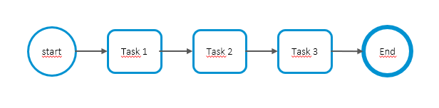
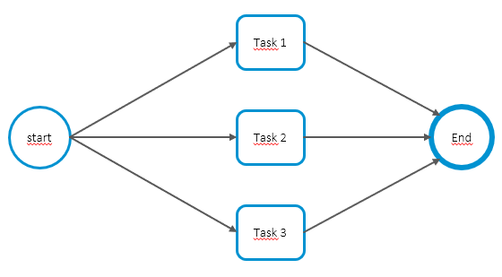
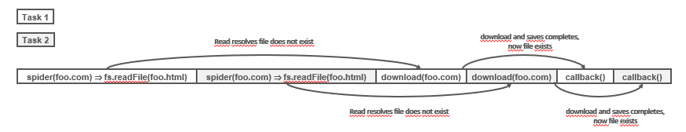

# Part 4: Node.js avanced patterns and techniques
## Chapter 30 &mdash; Asynchronous Control Flow Patterns with Callbacks
> tbd

### Contents (TBD)

### Intro
Asynchronous code and continuation-passing style (CPS) can be frustrating:
+ It is difficult to predict the order execution
+ It is easy to create inefficient and unreadable code when orchestrating sets of operations

### The difficulties of asynchronous programming
Let's create a simple program to illustrate the difficulties of asynchronous programming.

The program will be a simple *web crawler* that takes in a web URL as input and downloads its contents locally into a file.

The core functionality of the module will be contained inside a module `spider.js`, and will delegate some tasks to a local module `utils.js` and to the npm packages `superagent` and `mkdirp`.

Let's have a look at the `spider.js` file:

```javascript
import fs from 'fs';
import path from 'path';
import superagent from 'superagent';
import mkdirp from 'mkdirp';
import { urlToFilename } from './utils.js';

export function spider(url, cb) {
  const filename = urlToFilename(url);

  // has filename already been downloaded
  fs.access(filename, err => {
    // ENOENT means file did not previously exist
    if (err?.code === 'ENOENT') {
      superagent.get(url).end((err, res) => {
        if (err) {
          cb(err);
        } else {
          // create the dir that will host the file
          mkdirp(path.dirname(filename), err => {
            if (err) {
              cb(err);
            } else {
              // write the responde of the HTTP request to the file system
              fs.writeFile(filename, res.text, err => {
                if (err) {
                  cb(err);
                } else {
                  cb(null, filename, true);
                }
              });
            }
          });
        }
      });
    } else {
      cb(null, filename, false);
    }
  });
}
```

The function starts by checking whether the URL was already downloaded using `fs.access(...)`. If the response is different from `ENOENT` which is the result that tells us the file does not exist, the URL will be downloaded. Otherwise, it means the file has already been downloaded, and we invoke the received callback passing it the name of the downloaded file and `false` to signal it was already there.

Then, we access the URL and get the response using `superagent.get(url).end((err, res) => ...)`. If we find and error, we invoke the callback passing `err` in the first parameter. Otherwise, we proceed to the next step.

In the next step we use `mkdirp(path.dirname(filename), err => ...)` to create the directory that will contain the file.

Finally, we write the content that was downloaded using `fs.writeFile`.

The function is invoked from a `main.js` program that invokes the function with the parameter that was given to the program and the callback that just prints some informational messages telling the user how the process went:

```javascript
import { spider } from './lib/spider.js';

spider(process.argv[2] ?? 'http://www.example.com', (err, filename, downloaded) => {
  if (err) {
    console.error(`ERROR: main: ${ err.message }`);
  } else if (downloaded) {
    console.log(`INFO: Completed download of ${ filename }`);
  } else {
    console.log(`INFO: '${ filename } was already downloaded`);
  }
});
```

| EXAMPLE: |
| :------- |
| You have the first version of the web crawler in [01 &mdash; A simple web crawler](./01-a-simple-web-crawler/). |

#### Callback hell
Even in the simple example above, you can appreciate the several levels of indentation, and the number of nested `()` and `{}` that complicates the maintainability and readability of the code.

The situation where the abundance of closures and *in-place callback* definitions transforms the code in an unreadable and unmmanageable blob is known as **callback hell*. It's one of the most widely recognized and severe *anti-patterns* of Node.js and JavaScript in general:

```javascript
asyncFoo(err => {
  asyncBar(err => {
    asyncFooBar(err => {
      ...
    })
  })
});
```

The most evident problem with this code is its poor readability &mdash; it's impossible to keep track where a function ends and where another begins.

Another issue is caused by the overlapping of the variable names used in each scope &mdash; `err`, `cb`, etc. are likely to be reused in each of the functions and it is easy to lose track of which one you are referring to. Some developers name the variables as `err1`, `err2`... but that solution is not very good either.

### Callback best practices and control flow patterns
The previous example is a textbook definition of the callback hell that we should avoid. However, it is not the only problem we should be aware of wen writing asynchronous code with callbacks. Iteration and recursion also require special techniques.

#### Callback discipline
The first rule to keep in mind is:
> Do not abuse in-place definitions when defining callbacks.

It might be tempting not to do so, as it relieves you from thinking about modularity and reusability, but in the long run, complicates the solution.

You can also apply the following principles:
+ Exit as soon as possible &mdash; use `return`, `continue`, or `break`, depending on the context, to immediately exit the current statement instead of writing (and nesting) complete *if...else* statements.
+ Create named functions for callbacks, keeping them out of closures and passing intermediate results as arguments. Naming functions will also help with problem identification in stack traces.
+ Modularize the code. Split the code into smaller, reusable functions whenever possible.

#### Applying the callback discipline
Let's apply the previous principles to our simple web crawler.

The first step consists in changing the complete *if...else* function into *early returns*:

```javascript
// if (err) {
//   cb(err)
// } else {
//   // .. everything went well
// }
if (err) {
  return cb(err)
}
// everything went well
```

This is often referred to as the **early return principle**.

| NOTE: |
| :---- |
| A common mistake when doing this simple refactoring is to forget the `return` when doing the early exit from the function. Note also that the return code from the callback is typically ignored, as the result is passed using *CPS*.

The second optimization consists in identifying reusable pieces of code such as `saveFile(...)` and `download(...)`. This will make the code more readable and alleviate the *callback pyramid*.

| EXAMPLE: |
| :------- |
| You can find the refactoring of the web crawler in [02 &mdash; Refactoring the simple web crawler](./02-refactored-simple-web-crawler/). |

As a result of the factoring, nesting has been greatly reduced, which facilitates readability, and the definition of `saveFile(...)` and `download(...)` makes the code more reusable and testable.

#### Sequential execution
In this section, we will explore how to implement asynchronous control flow patterns, starting by looking at the sequential execution flow.



The main purpose of the flow is to run the tasks in sequence, one at a time and one after the other. The order of execution must be preserved because the result of a task in the list may affect the execution of the next.

There are several variations of this flow:
+ executing the tasks without propagating data across them
+ using the output of a task as the input for the next
+ iterating over a collection while running an asynchronous task on each element, one after the other

##### Executing a known set of tasks in sequence
Consider using the following *code guidelines* when execute a known set of asynchronous tasks in sequence:

```javascript
function task1(cb) {
  asyncOperation(() => {
    task2(cb)
  });
}

function task2(cb) {
  asyncOperation(() => {
    task3(cb)
  });
}

function task3(cb) {
  asyncOperation(() => {
    cb();
  });
}

// start the process
task1(() => {
  console.log(`tasks1 1, 2, and 3 executed in sequence`);
});
```

The pattern puts a lot of emphasis on the modularization of tasks, showing how it can be handled without extra packages or unnecessary closures.

Consider the following *concrete* example:

```javascript
function asyncStep1(cb) {
  console.log(`EXECUTING: asyncStep1`);
  setTimeout(() => {
    cb();
  }, 500);
}

function asyncStep2(cb) {
  console.log(`EXECUTING: asyncStep2`);
  setTimeout(() => {
    cb();
  }, 100);
}

function asyncStep3(cb) {
  console.log(`EXECUTING: asyncStep3`);
  setTimeout(() => {
    cb();
  }, 200);
}

function task1(cb) {
  asyncStep1(() => {
    console.log(`COMPLETED: task1`);
    task2(cb);
  });
}

function task2(cb) {
  asyncStep2(() => {
    console.log(`COMPLETED: task2`);
    task3(cb);
  });
}

function task3(cb) {
  asyncStep3(() => {
    console.log(`COMPLETED: task3`);
    cb();
  });
}

task1(() => {
  console.log(`tasks 1, 2, and 3 completed!`);
});
```

If we would execute them as if they were synchronous functions:

```javascript
asyncStep1(() => console.log(`COMPLETED: asyncStep1`));
asyncStep2(() => console.log(`COMPLETED: asyncStep2`));
asyncStep3(() => console.log(`COMPLETED: asyncStep3`));
```

they would not be executed one after the other.


The trick is realizing that the CPS can be used to *orchestrate* the sequence of calls. We interlace the sequencing of calls in the callbacks that we pass to each of the tasks:

```javascript
function taskN(cb) {
  asyncStepN(() => {
    taskM(cb);
  });
}
```

The logic associated to the function `asyncStepN(...)` would be executed as soon as we invoke it, and by passing as the callback a function that ultimately invoked the next task, we will ensure the proper ordering.


| EXAMPLE: |
| :------- |
| You can find the example in [03 &mdash; Static Sequencial Iteration](./03-static-sequential-iteration/). |

##### Sequential iteration with an example
This section deals with the scenario in which we cannot hardcode in advance the tasks that are to be executed. The underlying idea would be the same, only that know we will to build the task sequence dynamically.

To show it with an example, we'll introduce a few new features to the web crawler application:
+ We will download all the links contained in the web page recursively.
+ Instead of checking if a file already exists, we will try to read it and start spidering its links, so that we can resume interrupted downloads.
+ We add a new parameter `nesting` that will help us to limit the recursion depth.

The first step is to modify our `spider(...)` cuntions so that it triggers a recursive download of all the links from the page and then trigger our web crawler on each recursively and in sequence.

This recursive download of links is managed by a function named `spiderLinks()`. The logic is also updated to check whether the file already exists, and if it is so, start spidering its links.

```javascript
export function spider(url, nesting, cb) {
  const filename = urlToFilename(url);
  fs.readFile(filename, 'utf8', (err, fileContent) => {
    if (err) {
      if (err.code !== 'ENOENT') {
        return cb(err);
      }

      // ENOENT: file did not previously existed
      return downloadFile(url, filename, (err, requestContent) => {
        if (err) {
          return cb(err);
        }

        spiderLinks(url, requestContent, nesting, cb);
      });
    }

    // file already existed and was correctly read: process the links
    spiderLinks(url, fileContent, nesting, cb);
  });
}
```

The following piece of code implements the `spiderLinks(...)` function, which is the core of the new functionality. It downloads all the links of an HTML page using a sequential asynchronous iteration algorithm.

```javascript
function spiderLinks(currentUrl, body, nesting, cb) {
  if (nesting === 0) {
    // max nesting reached: return making sure the function is always async
    return process.nextTick(cb);
  }

  const links = getPageLinks(currentUrl, body);
  if (links.length === 0) {
    // no links in this page, return
    return process.nextTick(cb);
  }

  function iterate(index) {
    // processing links[index] from currentUrl
    if (index === links.length) {
      // all links processed!
      return cb();
    }

    // process links[index], updating nesting
    spider(links[index], nesting - 1, err => {
      if (err) {
        return cb(err);
      }
      // we're done with no errors, schedule next async iteration
      iterate(index + 1);
    });
  }

  // initial call to trigger the whole process
  iterate(0);
}
```

The important steps in the logic are:
+ We obtain the list of all the links in the page using `getPageLinks()` function. The function returns only the links pointing to the same `hostname` as the original `hostname` found in the argument.
+ We iterate over the links using a local function `iterate(...)`, which takes the index of the next link to analyze. We include a guard to stop the process if we're already at the end of the list of items to process.
+ We invoke `spider()` to handle the download of the next link, with the nesting reduce.
+ We bootstrap the iteration invoking `iterate(0)`.

| EXAMPLE: |
| :------- |
| You can review the full implementation in [04 &mdash; Web Crawler v2](./04-web-crawler-v2/). |


##### The pattern for sequential iteration over a collection
The following *code pattern* illustrates how to iterate asynchronously over the elements of a collection, or in general, over a list of tasks.

```javascript
function iterate(index) {
  if (index === tasks.length) {
    return finish();
  }
  const task = tasks[index];
  task(() => iterate(index + 1));
}

function finish() {
  // iteration completed
}

iterate(0);
```

This pattern can be adapted to several common use cases:
+ Map the values of an array asynchronously
+ Pass the results of an operation to the next one in the iteration to implement an asynchronous version of the *reduce* althorithm.
+ Quit the loop prematurely if a particular condition is met (e.g. async implementation of `Array.some()`).
+ Iterate over an infinite sumber of elements

Note that the pattern can be wrapped in a function:

```javascript
iterateSeries(collection, iteratorCallback, finalCallback) {
  ...
}
```

with:
+ `collection` &mdash; the dataset you want to iterate over
+ `iteratorCallback` &mdash; function that should be executed on every item
+ `finalCallback` &mdash; function to be executed when all the items have been processed or in case of error while iterating

> The **sequential iterator pattern** lets you execute a list of tasks in sequence by creating a function named `iterator`, which invokes the next available task in the collection and makes sure to invoke the next step of the iteration when the current task completes.

##### Parallel execution
When the order of execution of a set of asynchronous tasks is not important, and all we want is to be notified when all those running tasks are completed we can run the tasks using a parallel execution flow:



Note that this is possible in Node.js single-threaded model thanks to the non-blocking nature of the engine.

The details that explain how this *concurrent* or *parallel* execution is possible can be seen in the following sequence diagram. The diagram depicts how two asynchronous tasks *Task 1* and *Task 2* run in parallel in a Node.js program driven by *Main*:


1. The **Main** function triggers the execution of **Task 1** and **Task 2**. As they trigger a non-blocking asynchronous oepration, they immediately return control back to **Main**, which then returns to the **Event Loop**.

2. When the asynchronous operation of **Task 1** is completed, the **Event Loop** gives control to it. When **Task 1** completes its internal synchronous processing as well, it notifies the **Main** function.

3. When the asynchronous operation triggered by **Task 2** is complete, the **Event Loop** invokes its callback, giving control back to **Task 2**. At the end of **Task 2**, the **Main** function is notified once more. At this point, **Main** function knows that both **Task 1** and **Task 2** are complete, so it can continue its execution or return the results of the oeprations to another callback.

| NOTE: |
| :---- |
| This is also easy to understand with our Node.js mental model based on the *event loop*, a *call stack*, an *event queue*, and a set of underlying *runtime APIs*. |

Let's use this approach to build another version of our web crawler. In this case, instead of doing a sequential, recursive download of the linked pages, we will download all the linked pages in parallel.

The only function we need to modify is `spiderLinks(...)` to change the previous sequential approach for the parallel one:

```javascript
function spiderLinks(currentUrl, body, nesting, cb) {
  if (nesting === 0) {
    // make sure the behavior of the function is always async
    return process.nextTick(cb);
  }

  const links = getPageLinks(currentUrl, body);
  if (links.length === 0) {
    return process.nextTick(cb);
  }

  let completed = 0;
  let hasErrors = false;

  function done(err) {
    if (err) {
      hasErrors = true;
      return cb(err);
    }
    if (++completed == links.length && !hasErrors) {
      return cb();
    }
  }

  links.forEach(link => spider(link, nesting - 1, done));
}
```

Now the `spider(...)` tasks are started all at once by simply iterating over the links array and starting each task without waiting for the previous one to finish:

```javascript
links.forEach(link => spider(link, nesting - 1, done));
```

In order to control the status of the completed tasks, we provide `spider(...)` a custom callback that keeps track of the number of completed tasks and an error *guard*.

| EXAMPLE: |
| :------- |
| You can review the full implementation in [05 &mdash; Web Crawler v3](./05-web-crawler-v3/). |

##### The pattern for parallel execution over a collection of tasks
We can extract the pattern for the parallel execution flow as follows:

```javascript
const tasks = [ /* ...collection of tasks... */]

let completed = 0;
tasks.forEach(task => {
  task(() => {
    if (++completed === tasks.length) {
      finish();
    }
  });
});


function finish() {
  // all the tasks have been completed
}
```

This pattern can be adapted with small modifications to accumulate the results of each task into a collection, to filter or map the elements of an array, or to invoke the `finish()` callback as soon as one or any number of tasks complete, in what is called a **competitive race**.

> The **unlimited parallel execution pattern** runs a set of asynchronous tasks in parallel by launching them all at once, and then waits for all of them to complete by counting the number of times their callbacks are invoked.

##### Fixing race conditions with concurrent tasks
When we have multiple tasks running in parallel, we might have *race conditions* &mdash; contention to access external resources such as files or database records.

Identifying, and fixing race conditions in Node.js is a completely different story from the one you'd have for multithreaded programming languages. In those languages you would use *locks*, *mutexes*, *semaphores* and *monitors* to deal with task synchronization and race conditions. In Node.js, we don't need those synchronization mechanisms as everything runs on a single thread.

> However, that does not mean that we can't have *race conditions* in Node.js. *Race conditions* are quite common in Node.js the root cause has to do with the delay between the invocation of an asynchronous operation and the notification of its result.

In particular, our *Web Crawler v3* includes an obvious race condition:

```javascript
export function spider(url, nesting, cb) {
  const filename = urlToFilename(url);
  fs.readFile(filename, 'utf8', (err, fileContent) => {
    if (err) {
      if (err.code !== 'ENOENT') {
        return cb(err);
      }

      // ENOENT: file did not previously existed
      return downloadFile(url, filename, (err, requestContent) => {
      ...
```

Two `spider(...)` tasks operating on the same URL might invoke `fs.readFile(...)` on the same file before one of the two tasks completes the download and creates a file, causing both tasks to start a `downloadFile(...)` operation:



*Task 1* and *Task 2* are interleaved in a single thread of Node.js, and we see how we can get a race condition as two separate tasks will end up downloading and writing the same file.

In this case, we can fix it using a `Set()` that would let us prevent downloading a given URL twice:

```javascript
const spidering = new Set();

export function spider(url, nesting, cb) {
  if (spidering.has(url)) {
    console.log(`INFO: spider: skipping ${ url } as it has already been processed`);
    return process.nextTick(cb);
  }
  spidering.add(url);
```

As Node.js is single threaded, and there is no background async operation involved when interacting with the `spidering` set, we can ensure that we won't trigger the execution of any URL download twice at any point in time, and therefore, we won't have the race condition anymore.

| NOTE: |
| :---- |
| A possible optimization, especially if you're dealing with a large set, would be to remove the URL from `spidering` once the download has completed successfully, as then, the file itself would be used as the guard to control the URL is not processed again. |

Race conditions can cause many problems, even in a single-threaded environment such as the one that provides Node.js. Race conditions are very difficult to spot because of their ephemeral nature, so it's considered a good practice to be proactive trying to identifying them before hand, by looking for situations on which asynchronous tasks are running in parallel and depend on the outcome of asynchronous operations.

| EXAMPLE: |
| :------- |
| You can review the full implementation in [06 &mdash; Web Crawler v4: Fixing the race condition](./06-web-crawler-v4-race-condition-fix/). |

#### Limited parallel execution


### You know you've mastered this chapter when...

### Code, Exercises and mini-projects

#### [01 &mdash; A simple web crawler](./01-a-simple-web-crawler/)
First version of a simple web crawler that takes in a web URL as input and downloads its contents locally to a file

#### [02 &mdash; Refactoring the simple web crawler](./02-refactored-simple-web-crawler/)
Second version of the simple web crawler, in which the principles of the *callback discipline* have been applied.

#### [03 &mdash; Static Sequential Iteration](./03-static-sequential-iteration/)
Illustrates how to orchestrate a predefined set of asynchronous tasks, known in advanced, so that they are executed sequentially.

#### [04 &mdash; Web Crawler v2](./04-web-crawler-v2/)
The original example [01 &mdash; A simple web crawler](../01-a-simple-web-crawler) with some additional features and a recursive, sequential download of linked pages.

#### [05 &mdash; Web Crawler v3](./05-web-crawler-v3/)
The original example [01 &mdash; A simple web crawler](../01-a-simple-web-crawler) but applying a parallel downloading of linked pages.

#### [06 &mdash; Web Crawler v4: Fixing the race condition](./06-web-crawler-v4-race-condition-fix/)
An improvement over [05 &mdash; Web Crawler v3](../05-web-crawler-v3) that includes a fix for a possible race condition when two `spider()` tasks download the same file.

+ Mini-project: webcrawler that creates a simplified view of IMDB title page:
  + title
  + release year
  + Director/Creator
  + A few cast entries (the ones that appear in stars), plus the 5-10 initial ones

+ Exercise:
  + Implement 03 using the sequential iteration approach


  + Implement `iterateSeries(collection, iteratorCallback, finalCallback)`.
    + `collection` &mdash; the dataset you want to iterate over
    + `iteratorCallback` &mdash; function that should be executed on every item
    + `finalCallback` &mdash; function to be executed when all the items have been processed or in case of error while iterating
    + reimplement the first exercise using the iterateSeries