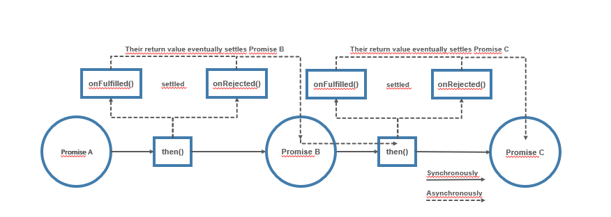

# Part 4: Node.js avanced patterns and techniques
## Chapter 31 &mdash; Asynchronous Control Flow Patterns with Promises and Async/Await
> TBD

### Contents (TBD)
+ How promises work and how to use them effectively to implement the main control flow constructs.
+ The async/await syntax, which is the main tool for dealing with asynchronous code in Node.js.

### Intro
The previous chapter demonstrated how needlessly complicated and error-prone are the code constructs used to implement even the simplest scenarios such as the serial execution flow.
Also, error managemen in callback-based code is very weak:
+ If we forget to forward an error, it will just get lost.
+ If we don't catch an exception thrown by a piece of some synchronous code, the program will crash.

In order to mitigate these weaknesses, Node.js and JavaScript have implemented native solutions. The first step toward a better developer experience (DX) when working with asynchronous code is the *promise* &mdash; an object that carries the status and the eventual result of an asynchronous operation. A promise can be easily chained to implement serial execution flows, and can be passed around like any other object. The second step, and the one that definitely creates a difference in terms of *DX* is the async/await construct, which finally makes asynchronous code look like synchronous code.

In today's Node.js programming, *async/await* is the recommended construct to deal with asynchronous code. However, async/await is built on top of promises, as much as promises are built on top of callbacks. That is why it is important to master all these concepts, no matter whether they are the current trend or not.

### Promises
*Promises* are part of the *ECMAScript 2015* standard (or ES6), and they've been available in Node.js for quite some time already (since v4). The standard settled on an implementation known as *Promises/A+*

#### What is a promise?
A `Promise` is an object that embodies the eventual result (or error) of an asynchronous operation. In promises jargon we say a `Promise` is:
+ *pending* &mdash; when the asynchronous operation is not yet complete
+ *fulfilled* &mdash; when the operation succesfully completed
+ *rejected* &mdash; when the operation terminates with an error
+ *settled* &mdash; when the promise is either fulfilled or rejected.

To receive the *fulfillment value* or the *error reason* associated with the rejection we can use the `then()` method of a `Promise` instance:

```javascript
promise.then(onFulfilled, onRejected)
```

where `onFulfilled` is a callback that will eventually receive the fulfillment value of the `Promise`, an `onRejected` is another callback that will received the reason for the rejection (if any). Both callbacks are optional.

Let's see how promises can transform our callback-based code with the following simple example involving an asynchronous operation handled with a callback.

```javascript
asyncOperation(arg, (err, result) => {
  if (err) {
    /* error handling here */
  }
  /* result processing here */
});
```

With promises, it would be written as:

```javascript
asyncOperationPromise(arg)
  .then(result => {
    /* result processing here */
  }, err => {
    /* error handling here */
  });
```

There does not seem to be much of change. However, we might have missed one crucial property of the `then()` method &mdash; it *synchronously* returns another `Promise`.

Moreover, if any of the `onFulfilled` or `onRejected` functions return a value `x`, the `Promise` returned by the `then()` will:
+ Fulfill with `x` if `x` is a value
+ Fulfill with the fulfillment value of `x` if `x` is a `Promise`
+ Reject with the eventual rejection reason of `x` if `x` is a `Promise`

That behavior allows us to build *chains of promises*, allowing easy aggregation and arrangement of asynchronous operations into several configurations. Additionally, if we don't specify an `onFulfilled` or `onRejected` handler, the fulfillment value or rejection reason will be forwarded to the next promise in the chain, which will help with error propagation.

As a result, the sequential execution of asynchronous tasks becomes a trivial operation:

```javascript
asyncOperationPromise(arg)
  .then(result1 => {
    // return another promise
    return asyncOperationPromise(arg2);
  })
  .then(result2 => {
    // return a value
    return 'done';
  })
  .then(undefined, err=> {
    /* error handling for the chain of promises here */
  });
```



The diagram above shows how the program flows when we use a chain of promises. When we invoke `then(...)` on *Promise A*, we synchronously receive *Promise B* as a result, and when we invoke `then(...)` on *Promise B* we synchronously receive *Promise C*.
That is, the whole chain of promises is *materialized synchronously* as soon as we declare it.

Eventually, when *Promise A* settles, it will either fulfill or reject, which will automatically trigger the execution of the `onFulfilled(...)` or `onRejected(...)` on *Promise B*, which in turn will trigger the execution of the corresponding handler on *Promise C* once settled.

An important property of promises is that the `onFulfilled()` and `onRejected()` callbacks are guaranteed to be invoked asynchronously, and at most once, even if we resolve the `Promise` synchronously with a value as we do in the example above with the `return 'done'`.

Not only that, the `onFulfilled()` and `onRejected()` callbacks will be invoked asynchronously even if the `Promise` object is already settled at the moment in which `then()` is called. This is a safeguard against situations where we could inadvertently mixing asynchronous and synchronous code (*Zalgo*).

Finally, if an exception is thrown in the `onFulfilled()` or `onRejected()` handlers, the `Promise` returned by the `then()` method will automatically reject with the exception that was thrown as the *rejection reason*. As a result, exceptions will propagate automatically across the chain and the `throw` statement becomes usable (as opposed to what happens with *CPS*, on which only synchronous code could throw).

#### Promises/A+ and *thenables*
Before promises were standardized, there were many incompatible implementations. The JavaScript community led the efforts to come up with the *Promises/A+* specification. This specification details the behavior of the `then()` method. Today, the majority of `Promise` implementations use this standards, including the native `Promise` object of JavaScript and Node.js but you have to be aware that if you are dealing with old code using a non-core library, you might make sure that library complies with the *Promises/A+* specification if you want to mix core and non-core promises in a chain with `then()`.

As a result of the adoption of *Promises/A+*, many `Promise` implementations, including the native JavaScript `Promise` API will consider any object with a `then()` method a *promise-like* object, also called a *thenable*.

| NOTE: |
| :---- |
| The technique of recognizing (or typing) objects based on their external behavior, rather than their actual type, is called **duck typing** (if it walks like a duck and it quacks like a duck, then it must be a duck) and is widely used in JavaScript. |

#### The Promise API
The `Promise` constructor creates a new `Promise` instance that fulfills or rejects based on the behavior of the function provided as an argument. The constructor expects a function that will receive two arguments:
+ `resolve(obj)` &mdash; a function that when invoked, with fulfill the `Promise` with the provided fulfillment value, which will be `obj` if `obj` is a value. It will be the fulfillment value of `obj` if `obj` is a *promise* or a *thenable*.
+ `reject(err)` &mdash; a function that when invoked, will reject the `Promise`the reason `err`. It is a convention for `err`to be an instance of `Error`.

```javascript
new Promise((resolve, reject) => {
  /*
    function whose logic will lead whether it is resolved/rejected.

    The function will use:
    + resolve(obj) to resolve the promise
    + reject(err) to reject the promise
  */
});
```

Apart from the constructor, the `Promise` object also features several important static methods:

+ `Promise.resolve(obj)` &mdash; creates a new `Promise` from another `Promise`, *thenable* or value. If a `Promise` is passed, then that `Promise` is returned as it is. If a *thenable* is provided, then it's converted to a `Promise`. If a value is provided, then the `Promise` will be fulfilled with that value.
+ `Promise.reject(err)` &mdash; creates a `Promise` that rejects with `err` as the reason.
+ `Promise.all(iterable)` &mdash; creates a `Promise` that fulfills with an array of fulfillment values when every item in the input iterable object (typically an array) fulfills. If any of the promises returned by `Promise.all()` rejects, then the `Promise` returned by `Promise.all()` will reject with the first rejection reason. Each item in the iterable argument can be a `Promise`, a *thenable* or a value.
+ `Promise.allSettles(iterable)` &mdash; waits for all the input promises to fulfill or reject, and then returns an array of objects containing the fulfillment value or the rejection reason for each input `Promise`. Each output object has a `status` property which can be either `'fulfilled'` or `'rejected'` and a `value` property containing the fulfillment value or error reason. The difference with `Promise.all()` is that `Promise.allSettled()` will wait for each and every promise to either fulfill or reject, instead of immediately rejecting when one of the promises rejects.
+ `Promise.race(iterable)` &mdash; This method returns a `Promise` that is equivalent to the first `Promise` in the iterable that settles.

The following instance methods of the `Promise` class are also relevant:

+ `promise.then(onFulfilled, onRejected)` &mdash; returns a *chainable promise* and will invoke the `onFulfilled()` or `onRejected` callbacks depending on how `promise` is settled.
+ `promise.catch(onRejected)` &mdash; *syntactic sugar* for `then(undefined, onRejected)`.
+ `promise.finally(onFinally)` &mdash; allows you to set up an `onFinally()` callback which will be invoked when `promise` is settled. Unlike `onFulfilled()` and `onRejected()`, the `onFinally()` callback will not receive any arguments and any value returned from it will be ignored. The `Promise` returned by `finally()` will be settled with the same fulfillment value or rejected reason as `promise`.

#### Creating a Promise

Creating a `Promise` from scratch is quite a low-level operation, and it is not typically done unless you're converting a callback-based API into promises.

Nonetheless, this is the way to create a `Promise` using its constructor:

```javascript
function delay(millis) {
  return new Promise((resolve, reject) => {
    setTimeout(() => {
      resolve(new Date())
    }, millis);
  });
}
```

Note how the entire body of the `delay(...)` function is wrapped by the `Promise` constructor: this is a frequent code pattern you will see when creating a `Promise` from scratch.

The newly created function can then be used as follows:

```javascript
console.log(`Delaying... ${ new Date().getSeconds() }`);
delay(1000)
  .then(newDate => {
    console.log(`Done: ${ new Date().getSeconds() });
  })
```

| EXAMPLE: |
| :------- |
| You can find a runnable example in [01 &mdash; Creating a `Promise` from scratch using its constructor](01-creating-a-promise-using-constructor). |

#### Promisification
When some characteristics of a callback-based function are known in advance, it's possible to create a function that transforms such function into an equivalent function returning a `Promise`. This transformation is called *promisification*.

For example, for the Node.js-style callback-based functions we know that:
+ the callback is the last argument to the function
+ the error (if any) is the first argument passed to the callback
+ any return value is passed after the error to the callback

The following code snippet is a simple implementation of this idea:

```javascript
function promisify(callbackBasedApi) {
  function promisified(...args) {
    return new Promise((resolve, reject) => {
      const newArgs = [
        ...args,
        function (err, result) {
          if (err) {
            return reject(err);
          }
          resolve(result);
        }
      ];
      callbackBasedApi(...newArgs);
    });
  }
  return promisified;
}
```

The preceding function returns another function which represents the *promisified* version of the `callbackBasedApi` function that receives as a parameter.

When the *promisified* version of the function is called, a promise is returned, and the logic that settles the promise is delegated to the callback-based function. That function is given the parameters passed to the *promisified* version, enhanced with a callback that rejects in case of error, or fulfills with the result otherwise.

You can use that function very easily:

```javascript
import { randomBytes } from 'crypto';

const randomBytesP = promisify(randomBytes);

randomBytesP(32)
  .then(buffer => {
    console.log(`Random bytes: ${ buffer.toString('hex') }`);
  });
```

| EXAMPLE: |
| :------- |
| You can find a runnable example in [02 &mdash; Promisification](02-promisification). |

It must be noted that our implementation of the `promisify()` function is quite naive and has some missing features. The `util` package of Node.js provides a more robust version of `promisify()`.

#### Sequential execution and iteration
At this point, we can start creating a promise-based version of our web crawler. To explore the patterns for sequential execution and iteration we will revert to the version which downloaded the links of a webpage in sequence.

Let's begin with our `lib/spider.js` file which is the one doing the heavy lifting of crawling and downloading the pages and links.

The first portion of the file contains all the necessary imports. Note that the main differences is that now we use the *promised-based* versions of the Node.js core module `fs`, and that we used the `util.promisify` to convert the callback-based APIs such as `mkdirp` into equivalent functions that return promises, so that we can chain them.

| NOTE: |
| :---- |
| The functions in `lib/utils.js` are synchronous, so there's no need to intervene there. Also, the newer version of `mkdirp` works with promises, so we forced using the legacy version to illustrate how to use `util.promisify()`. |

```javascript
import { promises as fsPromises } from 'fs';
import { dirname } from 'path';
import superagent from 'superagent';
import mkdirp from 'mkdirp';
import { urlToFilename, getPageLinks } from './utils.js';
import { promisify } from 'util';

const mkdirpPromises = promisify(mkdirp);
```

The first function we will rewrite is `download(...)`. Since this new version leverages promises, the implementation is more straightforward and easier to follow.

```javascript
function download(url, filename) {
  console.log(`Downloading ${ url } into '${ filename }'`);
  let content;
  return superagent.get(url)
    .then(res => {
      content = res.text;
      return mkdirpPromises(dirname(filename));
    })
    .then(() => fsPromises.writeFile(filename, content))
    .then(() => {
      console.log(`INFO: download: ${ filename } from ${ url } downloaded and saved!`);
      return content;
    });
}
```

As `superagent` is already promised-based, we can make the function return the result of invoking `superagent.get()` and chain the intermediate processing with `then()` invocations. The result of the top level promise (the `superagent.get()`) will be the result of the last `then()` of the chain. That is, the promise returned by the `download()` function will settle with the value of the `content` if everything goes according to plan, or rejected if any of the intermediate promises rejects.

The next function to tackle is `spiderLinks()`. This is the one that deals with a sequential iteration over a dynamic set of asynchronous tasks.

```javascript
function spiderLinks(currentUrl, content, nesting) {
  let promise = Promise.resolve();
  if (nesting === 0) {
    return promise;
  }
  const links = getPageLinks(currentUrl, content);
  for (const link of links) {
    promise = promise.then(() => spider(link, nesting - 1));
  }
  return promise;
}
```

Note that first we define an *empty* promise that we use as a starting point for the chain of promises. Then we loop over the links of the page and chained them by doing:

```javascript
for (... of ...) {
  promise = promise.then(...)
}
```

At the end of the loop, the `promise` variable will have the promise of the last `then()` invocation, which is what we will return to the caller.

Also, note that the execution will be sequential even when using promises because of the way in which we have chained them with the construct `promise = promise.then(iterLogic)`.

The last part for `lib/spider.js` consists in rewriting the `spider(...)` function:

```javascript
export function spider(url, nesting) {
  const filename = urlToFilename(url);
  return fsPromises.readFile(filename, 'utf8')
    .catch(err => {
      if (err.code !== 'ENOENT') {
        console.error(`ERROR: spider: could not read file ${ filename }: ${ err.message }`);
        throw err;
      }
      return download(url, filename);
    })
    .then(content => spiderLinks(url, content, nesting));
}
```

In the solution for `spider(...)` we are using `catch()` to handle any errors produced by `readFile()`. If the error has code `ENOENT`, it means the file has not been downloaded yet, and therefore we need to proceed to download it.

Note that we chain the promise returned by `download(...)` that will be settled with the content of the page (if everything goes according to plan) which we will then channeled into `spiderLinks()` whose returned promise will become the promise we return from the function.

Tha last part of the rewrite effort will consist in consuming the `spider(...)` function:

```javascript
spider(url, nesting)
  .then(() => console.log(`INFO: ${ url } successfully processed!`))
  .catch(err => console.error(`ERROR: main: ${ err.message }`));
```

The `catch()` handler at this level will intercept any error originating from the entire `spider()` process. This makes our code cleaner, as it relieves us from including any error propagation logic within the intermediate processes.


As an alternative to the iteration construct seen before, we can use the more compact `reduce()` method as an alternative:
```javascript
const promise = tasks.reduce((prev, task) => {
  return prev.then(() => {
    return task();
  });
}, Promise.resolve());
```

| EXAMPLE: |
| :------- |
| You can find a runnable example in [03 &mdash; Web Crawler v2 with promises](03-web-crawler-v2-promises/). |

#### Parallel execution
The unlimited parallel execution flow becomes trivial with promises as you can use `Promise.all(iterablePromises)` to create a promise that fulfills only when all the promises received as input are fulfilled.

The logic behind those promises will be executed in parallel, provided those are independent (that is, if there is no causal relationship between them).

As a an example, let's rewrite our web crawler v3 capabilities using this approach:

```javascript
function spiderLinks(currentUrl, content, nesting) {
  if (nesting === 0) {
    return Promise.resolve();
  }

  const links = getPageLinks(currentUrl, content);
  const promises = links.map(link => spider(link, nesting - 1));

  return Promise.all(promises);
}
```

The pattern consists in starting all the `spider()` tasks at once collecting the resulting individual promises in an array (`promises`), and then using `Promise.all()` to wait for all of them to be fullfilled. Note also that the process will fail is any of the promises reject, which is exactly what we want for this particular use case.


| EXAMPLE: |
| :------- |
| You can find a runnable example in [04 &mdash; Web Crawler v3: parallel unlimite execution with promises](04-web-crawler-v3-parallel-promises). |

#### Limited Parallel execution: implementing the `TaskQueue`
In this section we will globally limit the concurrency of our web crawler download tasks by reimplementing the `TaskQueue` class we used in the previous chapter.

As a reminder, the `TaskQueue` was a class extending from `EventEmitter` that would expose two instance methods:
+ `pushTask(task)` &mdash; adds a new asynchronous task to the queue of tasks to process.
+ `next()` &mdash; triggers the execution of the next set of tasks from the queue, taking into account the concurrency limit and the current number of tasks.

Let's start by reimplementing the `next()` method, where we trigger the execution of tasks until we reach the concurrency limit.

```javascript
next() {
  while (this.running < this.concurrency && this.queue.length) {
    const task = this.queue.shift();
    task().finally(() => {
      this.running--;
      this.next();
    });
    this.running++;
  }
}
```

The change is simple: as we expect `task()` to return a promise we can use the `finally()` method to make a recursive call.

Now, we implement a new method `runTask()`, that will take the place of the former `pushTask()`. It will be responsible for queueing a special wrapper function and also returning a newly built `Promise`. Such `Promise` will just forward the result (fulfillment or rejection of the promise returned by `task()`).

```javascript
runTask(task) {
  return new Promise((resolve, reject) => {
    this.queue.push(() => {
      return task().then(resolve, reject);
    });
    process.nextTick(this.next.bind(this));
  });
}
```

This function:
+ creates a new `Promise` using the constructor.
+ wrap the receive tasks in a function and pushes the latter to the queue. This function will be executed whenever there are free concurrency slots.
+ schedules the execution of `next()` on the next iteration of the event loop.

When the pushed wrapper function is finally invoked, we execute the task received as an input, and forward its results (either fulfilment value or rejection reason) to the outer promise created in `runTask`.

##### Updating the web spider
Now, let's apply our `TaskQueue` to the web crawler project.

```javascript
unction spiderLinks(currentUrl, content, nesting, queue) {
  if (nesting === 0) {
    return Promise.resolve();
  }

  const links = getPageLinks(currentUrl, content);
  const promises = links.map(link => spiderTask(link, nesting - 1, queue));

  return Promise.all(promises);
}

const spidering = new Set();
function spiderTask(url, nesting, queue) {
  if (spidering.has(url)) {
    return Promise.resolve();
  }
  spidering.add(url);

  const filename = urlToFilename(url);

  return queue
    .runTask(() => {
      return fsPromises.readFile(filename, 'utf8')
        .catch(err => {
          if (err.code !== 'ENOENT') {
            throw err;
          }
          return download(url, filename);
        });
    })
    .then(content => spiderLinks(url, content, nesting, queue));
}

export function spider(url, nesting, concurrency) {
  const queue = new TaskQueue(concurrency);
  return spiderTask(url, nesting, queue);
}
```

Note that the task we're queueing comprises just the retrieval of the contents of the URL from either local or HTTP. The `spiderLinks()` invocation has been purposely kept outside of the queue to avoid creating a deadlock if the depth of the spidering process is higher than the concurrency limit of the queue.

Note also that `spiderLinks()` uses `Promise.all()`. This is OK now because is the `TaskQueue` responsibility to ensure that we are not going beyond the concurrency limit of the tasks.

| EXAMPLE: |
| :------- |
| You can find a runnable example in [05 &mdash; Web Crawler v4: parallel execution with a `TaskQueue`](05-web-crawler-v4-task-queue-promises). |


#### Production packages for promise-based control flows
In production, you shouldn't rely on custom implementations of the parallel execution flows.

Instead, the following packages are recommended:
+ `p-limit` &mdash; run multiple promise-based tasks in parallel, controlling the number of concurrent executions-
+ `p-queue` &mdash; full featured promise-queue with concurrency control
+ `p-map` &mdash; `map()` function supporting promises and limited concurrency.


### Async/Await

### The problem with infinite recursion

### Summary


### You know you've mastered this chapter when...
+ You understand the difficulties of asynchronous code and CPS programming:

### Code, Exercises and mini-projects

#### [01 &mdash; Creating a `Promise` from scratch using its constructor](01-creating-a-promise-using-constructor)
Illustrates how to create a `Promise` using its constructor.

#### [02 &mdash; Promisification](02-promisification)
Illustrates how create a generic function that converts a Node.js callback style function into an equivalent function returning a `Promise`.

#### [03 &mdash; Web Crawler v2 with promises](03-web-crawler-v2-promises/)
A promise-based implementation of the web crawler program that illustrates the patterns for sequential execution and iteration (with promises). In this example, the links from the given web page are downloaded in sequence.

#### [04 &mdash; Web Crawler v3: parallel unlimite execution with promises](04-web-crawler-v3-parallel-promises)
A revision of the v2 version, using promises, in which the links are downloaded in parallel.

#### [05 &mdash; Web Crawler v4: parallel execution with a `TaskQueue`](05-web-crawler-v4-task-queue-promises)
A revision of the v3 version, using promises, in which the links are downloaded in parallel, but limited to the degree of concurrency with which a `TaskQueue` is created.

#### Example 1: [File Concatenation](./e01-file-concatenation/)
Write the implementation of `concatFiles(...)`, a promise-based function that takes two or more paths to text files in the file system and a destination file.

This function must copy the contents of every source file into the destination file, respecting the order of the files as provided by the arguments list. Also, the function must be able to handle an arbitrary number of arguments.

#### Example 2: [Returning values from promises](./e02-returning-values-from-promises/)
Write `listNestedFiles()`, a promise-based function that takes as the input the path to a directory in the local

#### Example 3: [List files recursively](./e03-list-files-recursively/)
Write `listNestedFiles()`, a promise-based function that takes as the input the path to a directory in the local filesystem, and that asynchronously iterates over all the subdirectories to eventually return a promise that is fulfilled with the list of all the files discovered.

#### Example 4: [Hello, `TaskQueue` with promises](./e04-hello-task-queue-promises)
A very simple example demonstrating the usage pattern for our `TaskQueue`, promise-based class. In the example, we use the `TaskQueue` to classify a large number of numbers into even and odd.


+ Rewrite callback based exercises with promises
+ Create hello projects for the listed p-* packages
+ hello reduce, apply in sequential iteration