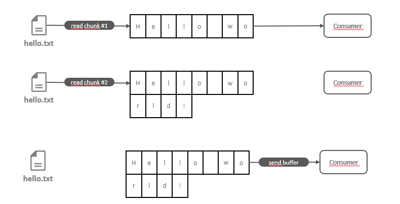
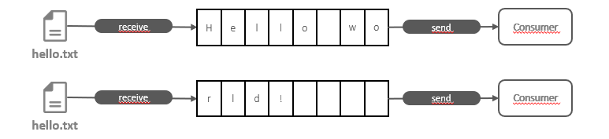
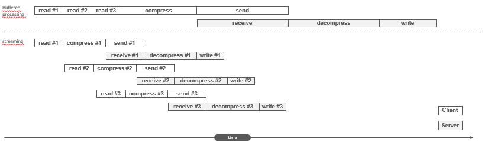

# Part 4: Node.js avanced patterns and techniques
## Chapter 32 &mdash; Coding with streams
> 188

### Contents
+ Understand why streams are so important in Node.js
+ The async/await syntax, which is the main tool for dealing with asynchronous code in Node.js.
+ Patterns for serial and parallel execution flow: Producers and Consumers
+ Anti-patterns: `return vs. return await`, and `await` with `Array.forEach()`

### Intro
This chapter aims to provide a complete understanding of Node.js streams &mdash; one of the best and most misunderstood topic of Node.js.

We will start with an introduction to the main ideas, terminology and libraries backing the Node.js streams, and then we will cover more advanced topics including useful streaming patterns that can make your programs more elegant and effective.

### Discovering the importance of streams
Node.js is an event-based platform. As such, the most efficient way to handle is I/O in real time &mdash; consuming the available input as soon as it is available and sending the output as soon as the application produces it.

This section will give an initial introduction to Node.js and their strengths to make real-time I/O processing a reality.

#### Buffering versus streaming
The paradigm when dealing with I/O up to this point is called *buffer mode*.

In this mode, an input operation makes all the data coming from a resource to be collected into a buffer until the operation is completed. Then it is passed back to the caller as one single blob of data.



The diagram above depicts how the buffer mode works.
1. Some data is received from the resource saved into a buffer.
2. Additional chunks are received and buffered.
3. The entire buffer is made available to the consumer when the read operation is complete.

On the contrary, processing with streams is radically different &mdash; data is made available to the consumer as soon as it arrives from the resource:



As soon as a new *chunk of data* is received from the resource, it is immediately passed to the consumer, who has the chance to process it right away.

There are three main advantages of streams vs. buffering:
+ spatial efficiency &mdash; no need to materialize the whole contents of the resource before it can be processed.
+ time efficiency &mdash; information can be processed as soon as it is produced by the resource, rather than having to wait until it is materialized
+ composability


#### Spatial efficiency
Streams provide a great advantage over buffers, because they don't require the materialization of the whole set of information provided by the resource before being processed.

This becomes really important for big files, especially in a platform such as Node.js where there is limitation on the size of a memory buffer

| EXAMPLE: |
| :------- |
| Run [01 &mdash; Max size of a buffer in this platform](01-display-buffer-max-size) to obtain the maximum size of a buffer in the current platform. |


##### Gzipping using a buffered API
As an example of this limitation we might face with buffers, let's consider the following utility that gzips a given file.

```javascript
import { promises as fs } from 'fs';
import { gzip } from 'zlib';
import { promisify } from 'util';

const gzipPromise = promisify(gzip);

const filename = process.argv[2];

async function main() {
  const data = await fs.readFile(filename);
  const gzippedData = await gzipPromise(data);
  await fs.writeFile(`${ filename }.gz`, gzippedData);
}

main();
```

Everything will be fine for small files, but if we try to zip something larger than the platfom maximum buffer size we will get an error, because the approach requires the materialization of the whole contents of the file before it can be zipped.

| EXAMPLE: |
| :------- |
| See [02 &mdash; GZIP with buffers](02-gzip-with-buffers) for a runnable example. |

##### Gzipping using streams

Let's see how we can provide the same functionality using streams:

```javascript
import { createReadStream, createWriteStream } from 'fs';
import { createGzip } from 'zlib';


const filename = process.argv[2];

createReadStream(filename)
  .pipe(createGzip())
  .pipe(createWriteStream(`${ filename }.gz`))
  .on('finish', () => console.log(`INFO: ${ filename } => ${ filename }.gz`));
```

Note that not only the application will be more efficient, but also more readable thanks to the streams interface and composability.

| EXAMPLE: |
| :------- |
| See [03 &mdash; GZIP with streams](03-gzip-with-streams) for a runnable example. |


#### Time efficiency

Let's implement a more complex example involving an application with two subcomponents.

The client side of the application will compress a file, and send it to a remote HTTP server. In turn, the server side of the application will be listening for incoming requests that will assume to be gzipped files that it will decompress and save into the file system.

Obviously, this is a textbook scenario for streams, as we wouldn't want the client to materialize the file before being able to send it to the server, and we wouldn't want the server to recreate the file in memory before it can save it (imagine with multiple concurrent requests involving large file!).

Therefore:
+ on the client side we will use streams to allow compressing the information and sending data chunks as soon as they are read from the filesystem.
+ on the server side, we will use streams to decompress every chunk as soon as it is received, and straight away save it.

Let's review the server-side implementation first:

```javascript
import { createServer } from 'http';
import { createWriteStream } from 'fs';
import { createGunzip } from 'zlib';
import path from 'path';


const server = createServer((req, res) => {
  const filename = path.basename(req.headers['x-filename']);
  const destFilename = path.join('received_files', filename);
  console.log(`INFO: file request received: ${ filename }`);

  req
    .pipe(createGunzip())
    .pipe(createWriteStream(destFilename))
    .on('finish', () => {
      res.writeHead(201, { 'Content-Type': 'text/plain' });
      res.end('OK\n');
      console.log(`INFO: file saved: ${ destFilename }`);
    });
});

server.listen(5000, () => console.log(`INFO: listening on http://localhost:5000`));
```

Note that the `req` object is actually a *stream*, so we can use it to receive the chunks of data right away from the network and act upon them without having to materialize the whole file.

This processing consists in the decompression and write on a given location.

Let's now deal with the client part:

```javascript
import { request } from 'http';
import { createGzip } from 'zlib';
import { createReadStream } from 'fs';
import path from 'path';


const filename = process.argv[2];

const httpRequestOptions = {
  hostname: 'localhost',
  port: 5000,
  path: '/',
  method: 'PUT',
  headers: {
    'Content-Type': 'application/octet-stream',
    'Content-Encoding': 'gzip',
    'X-Filename': path.basename(filename)
  }
};

const req = request(httpRequestOptions, res => {
  console.log(`INFO: Server responded with: ${ res.statusCode }`);
});

createReadStream(filename)
  .pipe(createGzip())
  .pipe(req)
  .on('finish', () => console.log(`INFO: file ${ filename } successfully sent`));
```

We are again using taking advantage that the HTTP request object `req` is a stream, and therefore, we read the file, compress it and send it to the server as soon as a every chunk is available.

| EXAMPLE: |
| :------- |
| See [04 &mdash; GZIP client/server with streams](04-gzip-client-server) for a runnable example. |


The following diagram illustrates why using streams is far more efficient when compared to the buffered API.



Note how when using the *buffered mode*, the process is entirely sequential, with each of the defined stages happening after the other, first on the client side and then on the server.

However, when using streams, those processing stages are triggered as soon as a data chunk is available, without waiting for the whole file to be read. Also, as each of the individual stages are asynchronous, many different of these stages will be parallelized by Node.js. The platform will take care of the proper sequencing and ordering of the data chunks.

#### Composability
We've seen in the examples how powerful composability with streams is:

```javascript
createReadStream(filename)
  .pipe(createGzip())
  .pipe(req)
  .on('finish', () => console.log(`INFO: file ${ filename } successfully sent`));
```

This composability is orchestrated via the `pipe(...)` method, and allows us to connect the different *processing units/stages*, each one of those performing a single, focused functionality.

Streams features a uniform API that makes it possible, with the only constraint being that the next stream in the pipeline has to support the data produced by the previous stream, which can be binary data, text data or even objects.

##### Adding encryption as an example of composability
To further demonstrate the composability, let's add an encryption layer to our [04 &mdash; GZIP client/server with streams](04-gzip-client-server), starting with the client side.


You can review all the implementation details in [05 &mdash; GZIP client/server with an encryption layer](05-gzip-encryption-client-server), but in summary in, once all the crypto initialization is correctly performed do the following on the server side and client side respectively:

```javascript
req
  .pipe(createDecipheriv('aes192', secret, iv))
  .pipe(createGunzip())
  .pipe(createWriteStream(destFilename))
  .on('finish', () => {
      res.writeHead(201, { 'Content-Type': 'text/plain' });
      res.end('OK\n');
      console.log(`INFO: file saved: ${ destFilename }`);
  });
```

That is, on the server side we expect to get the binary data encrypted, and then we have to *gunzip* it.


```javascript
createReadStream(filename)
  .pipe(createGzip())
  .pipe(createCipheriv('aes192', secret, iv))
  .pipe(req)
  .on('finish', () => console.log(`INFO: file ${ filename } successfully sent`));
```

And on the client side, we first *gzip* the file and then encrypt it.

The main advantage is evident, with just a few lines of code we have been able inject new capabilities into an existing pipeline.

### Getting started with streams
Streams are virtually everywhere in Node.js: file-system management, HTTP modules, crypto, compression utilities, ...

#### Anatomy of streams
Every *stream* in Node.js is an implementation of one of the following four base abstract classes defined in the `stream` core module:
+ `Readable`
+ `Writable`
+ `Duplex`
+ `Transform`

In turn, each `stream` class inherit from `EventEmitter` and produce several types of events including:
+ `'end'` &mdash; when a `Readable` stream has finished reading
+ `'finish'` &mdash; when a `Writable` stream has finished writing
+ `'error'` &mdash; when an unexpected situation is found

Streams in Node.js support two operating modes:
+ binary mode &mdash; to stream data in form of chunks, such as buffers or strings
+ object mode &mdash; to stream data as a sequence of discrete objects

While the first mode will be mostly used for I/O, the second one will open a handful of possibilities to structure an application as processing units in a functional fashion.

#### Readable streams
A `Readable` stream represents a source of data.

Data can be received from a `Readable` stream using two approaches: *non-flowing* (or *paused*) and *flowing*.

##### Reading from a stream: *non-flowing* mode
The non-flowing or paused mode is the default pattern for reading from a `Readable` stream.

It consists in attaching a listener to the stream for the `'readable'` event, which signals the availability of new data to read. Then in a loop, we read the data continuously until the internal buffer is emptied.

This can be done using the `read()` method, which synchronously reads from the internal buffer and returns a `Buffer` object representing the chunk of data:

```javascript
readable.read([size])
```

To illustrate this approach, let's create an example that reads from the standard input and echoes everything to the standard output.

| NOTE: |
| :---- |
| `process.stdin` is a stream representing the standard input. |

```javascript
process.stdin
  .on('readable', () => {
    let chunk;
    console.log(`INFO: new data available`);
    while ((chunk = process.stdin.read()) !== null) {
      console.log(`INFO: chunk read (${ chunk.length } bytes): '${ chunk.toString() }'`);
    }
  })
  .on('end', () => console.log('INFO: end of stream'));
```

In the example, we use the `read()` method which is a synchronous operation that pulls a data chunk from the internal buffers of the `Readable` stream. The returned chunk is by default a `Buffer` object if the stream is working in binary mode (which is the default).

The `read(...)` method returns `null` when there is no more data available in the internal buffers. In cush case, we have to wait for another `'readable'` event to be fired, or wait for the `'end'` event that signals the end of the stream.

The `read(...)` method allows you to specify the amount of data to be read.

In a `Readable` stream working in binary mode, you can read strings instead of buffers by calling `setEncoding(encoding)` which you can set to `'utf8'`. This is the recommended approach when streaming UTF-8 text data, as it will correctly handle multibyte characters.

You can call `setEncoding(...)` as many times as needed on a `Readable` stream. The encoding will be switched dynamically on the next available chunk.

| NOTE: |
| :---- |
| Streams are inherently binary; encoding is just a view over the binary data emitted by the stream. |

| EXAMPLE: |
| :------- |
| See [06 &mdash; Reading from stdin as a stream](06-read-stdin) for a runnable example. |

##### Reading from a stream: *flowing* mode
An alternative way to read from a stream is the *flowing* mode which consists in attaching a listener to the `'data'` event. When using this mode, the data is not pulled using `read()`, but instead, it is pushed to the data listener as soon as it arrived.

```javascript
process.stdin
  .on('data', chunk => {
    console.log(`INFO: new data available`);
    console.log(`INFO: chunk read (${ chunk.length } bytes): '${ chunk.toString() }'`);
  })
  .on('end', () => console.log('INFO: end of stream'));
```

This mode offers less flexibility to control the flow of data compared to the *non-flowing* mode.

To enable the flowing mode you can:
+ attach a listener to the `'data'` event
+ explicitly invoke the `resume()` method

You can also temporarily stop the stream from emitting `'data'` events invoking the `pause()` method on the stream. Calling `pause()` will switch the stream to the default *non-flowing* mode.

| EXAMPLE: |
| :------- |
| Please review [07 &mdash; Reading from stdin as a stream using the *flowing mode*](07-read-stdin-flowing-mode) for a runnable example. |

##### Async iterators
*Readable streams* are also async iterators. We'll explore those in greater detail on a later chapter, but for now, just consider that the previous example can be implemented as the following:

```javascript
async function main() {
  for await (const chunk of process.stdin) {
    console.log(`INFO: new data available`);
    console.log(`INFO: chunk read (${ chunk.length } bytes): '${ chunk.toString() }'`);
  }
  console.log('INFO: end of stream');
}

main()
  .then(() => console.log(`processing of readable stream completed`));
```

That is, it is possible to consume an entire *readable stream* using promises.

| EXAMPLE: |
| :------- |
| Please see [08 &mdash; Reading from stdin as *async iterators*](08-read-stdin-async-iterator) for a runnable example. |

##### Implementing Readable streams
This section deals with how to implement a new *readable stream*. To do this, it is necessary to create a new class inheriting from `Readable`. The class must provide an implementation of the `_read()` method with signature:

```javascript
readable._read(size)
```

The `Readable` base class will call the `_read(...)` method, which in turn will fill the internal buffer using `push` (`readable.push(chunk)`).

| NOTE: |
| :---- |
| `read(...)` is the method called by `Readable` consumers when retrieving data from a *readable stream. By contrast, `_read(...)` is the method invoked by the `Readable` base class to fill the *readable stream* internal buffer. Filling the buffer is a `_read(...)` responsibility and it is done invoking `push(...)`. |

Consider the following implementation of a *readable* stream, that exposes a `RandomStream` class that generate random strings.

```javascript
import { Readable } from 'stream';
import Chance from 'chance';

const chance = new Chance();

export class RandomStream extends Readable {
  constructor(options) {
    super(options);
    this.emittedBytes = 0;
  }

  _read(size) {
    const chunk = chance.string({ length: size });
    this.push(chunk, 'utf8');
    this.emittedBytes += chunk.length;
    if (chance.bool({ likelihood: 5 })) {
      this.push(null);
    }
  }
}
```

At the top of the file we load our dependencies.

| NOTE: |
| :---- |
| `chance` is an npm utility module to generate random value of different classes (number, strings, sentences....). |

Then we define our constructor, that calls `super(...)` to invoke the constructor of the parent class so that the underlying `Readable` stream is properly initialized.

The `Readable` constructor allows the following options:
+ `encoding` &mdash; used to convert buffers into strings (defaults to `null`).
+ `objectMode` &mdash; used to flag if the stream is a binary stream (default) or an object stream (`objectMode=true`).
+ `highWaterMark` &mdash; the upper limit for the amount of data (in bytes) stored in the internal buffer, after which no more reading from the source should be done (defaults to 16KB).

In the `_read()` method we do the following:
1. Invoke `chance.string(...)` to generate a string of the requested length.
2. Fill the internal buffer using `this.push()`. As we're pushing strings, we set the encoding to `'utf8'`.
3. Terminates the stream randomly, with a likelihood of 5%, by pushing a `null` into the internal buffer.

| NOTE: |
| :---- |
| The `size` parameter in `_read()` is an advisory parameter. It's good to honor it if present, as it means the caller is requesting that amount of data. However, the caller might not use it. |

| EXAMPLE: |
| :------- |
| Please see [09 &mdash; `RandomStream`: a random string generator as a stream](09-random-stream) for a runnable example of how to create a custom readable stream. |

#### Writable streams

##### Writing to a stream

##### Backpressure

##### Implementing Writable

#### Duplex streams

#### Transform streams

##### Implementing Transform

##### Filtering and aggregating

#### PassThrough streams

##### Observability

##### Late piping

#### Lazy streams

#### Connecting streams using pipelines

##### Pipes and error handling

##### Better error handling with

### Asynchronous control flow patterns

### Piping patterns

### Summary


### You know you've mastered this chapter when...

+ You're aware that a `Promise` is and object that wraps the eventual result (or error reason) of an asynchronous oepration, and are familiar with the different *states* of a promise: *pending*, *fulfilled*, *rejected*, and *settled*.

### Code, Exercises and mini-projects

#### [01 &mdash; Max size of a buffer in this platform](01-display-buffer-max-size)
Displays the maximum size of a buffer in this platform.

#### [02 &mdash; GZIP with buffers](02-gzip-with-buffers)
Gzips an existing file using buffer mode APIs.

#### [03 &mdash; GZIP with streams](03-gzip-with-streams)
Gzips an existing file using streams.

#### [04 &mdash; GZIP client/server with streams](04-gzip-client-server)
An application consisting of a client and server components, on which the client *streams* a file in gzipped form to a remote server, who in turns decompresses and saves it in another location.

#### [05 &mdash; GZIP client/server with an encryption layer](05-gzip-encryption-client-server)
an enhancement on [04 &mdash; GZIP client/server with streams](../04-gzip-client-server) which adds an extra layer of encryption to demonstrate the power of streams composability.

#### [06 &mdash; Reading from stdin as a stream](06-read-stdin)
Illustrates how to read from a `Readable` stream using the default non-flowing mode that consists in attaching a listener to the `'readable'` event.

#### [07 &mdash; Reading from stdin as a stream using the *flowing mode*](07-read-stdin-flowing-mode)
Illustrates how to read from a `Readable` stream using the flowing mode (as opposed to the default *non-flowing* mode seen on [06 &mdash; Reading from stdin as a stream](../06-read-stdin)) that consists in attaching a listener to the `'data'` event.

#### [08 &mdash; Reading from stdin as *async iterators*](08-read-stdin-async-iterator)
Illustrates how to read from a `Readable` stream using the async iterator pattern. This lets you consume an entire *readable stream* using promises.

#### [09 &mdash; `RandomStream`: a random string generator as a stream](09-random-stream)
Illustrates how to implement a custom *readable* stream by inheriting from `Readable`. The example creates a stream `RandomStream` that produces random strings, and then we consume from `RandomStream` using the *non-flowing* and *flowing* mode.

#### Example 1: [File Concatenation](./e01-file-concatenation/)
Write the implementation of `concatFiles(...)`, a promise-based function that takes two or more paths to text files in the file system and a destination file.

This function must copy the contents of every source file into the destination file, respecting the order of the files as provided by the arguments list. Also, the function must be able to handle an arbitrary number of arguments.

